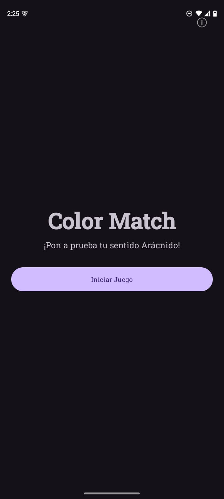
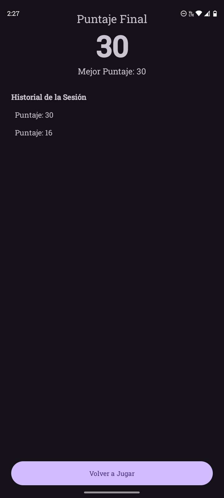

# ParcialKotlinsito

# **Color Match Game**

## 🎯 **1. Objetivo del Proyecto**

**Color Match Game** es un juego para Android desarrollado en Kotlin que pone a prueba los reflejos y la velocidad de reconocimiento de colores del usuario. El objetivo es simple: presionar el botón que coincida con el color mostrado en el centro de la pantalla. El jugador tiene 30 segundos para lograr la mayor cantidad de aciertos posible.

Este proyecto fue desarrollado como una práctica integral para dominar conceptos fundamentales del desarrollo de Android moderno, incluyendo una arquitectura limpia **MVVM**, el componente de navegación de Jetpack, el manejo del ciclo de vida, la persistencia de datos con `SharedPreferences` y el diseño de interfaces de usuario dinámicas y reactivas.

## 🖼️ **Capturas de Pantalla**


| Pantalla de Bienvenida | Pantalla de Juego | Pantalla de Resultados |
| :---: |:---:|:---:|
|  |  |  |

## ✨ **Características (Features)**

La aplicación está dividida en tres pantallas principales:

*   **🧩 WelcomeFragment:**
    *   Muestra el título del juego y las reglas a través de un `AlertDialog` que aparece automáticamente.
    *   Contiene un botón para iniciar la partida.
    *   Incluye un botón de información para volver a consultar las reglas.

*   **🎮 GameFragment:**
    *   Presenta un cuadro central que cambia a un color aleatorio.
    *   Múltiples botones de colores para que el usuario seleccione su respuesta.
    *   Un temporizador de 30 segundos que corre en cuenta regresiva.
    *   Muestra en tiempo real el puntaje actual y el tiempo restante.
    *   Navega automáticamente a la pantalla de resultados cuando el tiempo se agota.

*   **🏆 ResultFragment:**
    *   Muestra el puntaje final obtenido en la última partida.
    *   Guarda y muestra el puntaje más alto histórico utilizando `SharedPreferences`.
    *   Utiliza un `RecyclerView` para mostrar un historial de los puntajes obtenidos durante la sesión actual (no persistente).
    *   Ofrece un botón para "Volver a Jugar", reiniciando el ciclo.

## 🏗️ **Arquitectura y Estructura del Proyecto**

El proyecto sigue una arquitectura **MVVM (Model-View-ViewModel)** para garantizar una clara separación de responsabilidades, facilitar las pruebas y mejorar la mantenibilidad.

*   **Model:** Representa los datos y la lógica de negocio.
    *   `ColorOption.kt`: Modelo de datos para cada color del juego.
    *   `GameState.kt`: Encapsula todo el estado de la pantalla del juego en un único objeto inmutable.
    *   `SharedPreferencesManager.kt`: Actúa como fuente de datos para la persistencia del puntaje más alto.

*   **View:** Es la capa de UI (Fragments y Layouts XML), responsable de mostrar los datos y notificar las interacciones del usuario al ViewModel.
    *   `WelcomeFragment`, `GameFragment`, `ResultFragment`.

*   **ViewModel:** Actúa como intermediario. Contiene la lógica de la UI, gestiona el estado y lo expone a la View a través de `LiveData`. Es independiente del ciclo de vida de la View.
    *   `GameViewModel`, `ResultViewModel`, `SharedViewModel`.

### **Estructura de Archivos**

```
com.example.colormatchfloo/
├── 📂 adapters
│   └── 📜 ScoreAdapter.kt
├── 📂 data
│   └── 📜 SharedPreferencesManager.kt
├── 📂 model
│   ├── 📜 ColorOption.kt
│   └── 📜 GameState.kt
├── 📂 ui
│   ├── 📂 game
│   │   ├── 📜 GameFragment.kt
│   │   └── 📜 GameViewModel.kt
│   ├── 📂 result
│   │   ├── 📜 ResultFragment.kt
│   │   └── 📜 ResultViewModel.kt
│   ├── 📂 welcome
│   │   └── 📜 WelcomeFragment.kt
│   ├── 📜 MainActivity.kt
│   └── 📜 SharedViewModel.kt
└── 📂 utils
    └── 📜 Constants.kt
```

## 🧪 **Justificación de Conceptos Practicados**

A continuación se detalla dónde se ha aplicado cada uno de los conceptos clave del desarrollo de Android:

1.  **Navegación entre Fragments y paso de datos.**
    *   **Justificación:** Se utiliza el componente de navegación de Jetpack. El flujo completo está definido en `res/navigation/nav_graph.xml`.
    *   Las transiciones se ejecutan desde los Fragments usando `findNavController().navigate(...)`.
    *   Para el paso de datos seguro, se utiliza **Safe Args**. Por ejemplo, `GameFragment` pasa el puntaje final a `ResultFragment` a través de la clase autogenerada `GameFragmentDirections`.

2.  **Uso de temporizador (CountDownTimer).**
    *   **Justificación:** La lógica del temporizador de 30 segundos se encuentra encapsulada dentro de `ui/game/GameViewModel.kt`. Se inicia en el método `startTimer()` y se cancela de forma segura en `onCleared()` para evitar fugas de memoria.

3.  **Interacción con el usuario a través de botones y feedback.**
    *   **Justificación:** Los botones están definidos en los layouts XML (`fragment_welcome.xml`, `fragment_game.xml`). Sus `setOnClickListener` están implementados en sus respectivos Fragments (`WelcomeFragment.kt`, `GameFragment.kt`), los cuales delegan la lógica al ViewModel correspondiente.

4.  **Manejo de estados y lógica condicional básica.**
    *   **Justificación:** El estado de la pantalla de juego se modela con la data class `model/GameState.kt`. El `GameViewModel.kt` gestiona este estado: actualiza el puntaje si la respuesta es correcta (`onColorSelected`), genera un nuevo color y actualiza el `LiveData` para que la UI reaccione.

5.  **Diseño de UI con ConstraintLayout.**
    *   **Justificación:** Los layouts `fragment_game.xml` y `fragment_result.xml` utilizan `ConstraintLayout` para posicionar los elementos de forma flexible y adaptable a diferentes tamaños de pantalla. `fragment_welcome.xml` fue refactorizado a `LinearLayout` para garantizar la estabilidad en el arranque.

6.  **Control de errores y validación del input del usuario.**
    *   **Justificación:** El control de errores se manifiesta en la gestión del ciclo de vida. Por ejemplo, se usa un `_binding` nullable en los Fragments que se limpia en `onDestroyView()` para prevenir fugas de memoria. El `CountDownTimer` también se cancela en `onCleared()` del ViewModel.

7.  **Organización del código y buenas prácticas de programación en Kotlin.**
    *   **Justificación:** El código está organizado por funcionalidad en paquetes (`ui/game`, `data`, `model`). Se usan características de Kotlin como `data class`, `object` para constantes, delegados (`by viewModels()`) y funciones de extensión (`findNavController`).

8.  **Uso adecuado de recursos visuales (colores, imágenes, etc).**
    *   **Justificación:** Todos los colores están centralizados en `res/values/colors.xml`, los textos en `res/values/strings.xml` y los estilos en `res/values/styles.xml`. Se utiliza un drawable (`res/drawable/circle_button_background.xml`) para la forma de los botones.

9.  **Almacenamiento básico de datos usando SharedPreferences.**
    *   **Justificación:** La lógica de lectura y escritura del puntaje más alto está encapsulada en la clase `data/SharedPreferencesManager.kt`. El `ResultViewModel.kt` utiliza esta clase para obtener y guardar el récord.

10. **Uso de AlertDialog.**
    *   **Justificación:** En `ui/welcome/WelcomeFragment.kt`, la función `showGameRulesDialog()` crea y muestra un `AlertDialog` con las reglas del juego. Se llama automáticamente al iniciar el fragmento.

11.  **Funcionalidades Adicionales Implementadas**
*   **🔊 Sonidos:**
    *   **Justificación:** La gestión del audio está completamente **encapsulada** en la clase `utils/SoundManager.kt`. Esta clase utiliza la herramienta adecuada para cada tarea:
        *   **`SoundPool`:** Para los efectos de sonido cortos de **acierto** y **error**. Se eligió por su baja latencia y eficiencia, ya que precarga los sonidos en memoria.
        *   **`MediaPlayer`:** Para la **música de fondo**, ya que es ideal para archivos de audio más largos.
    *   La **comunicación MVVM** se maneja de forma limpia: el `GameViewModel.kt` emite un evento de un solo uso (`_soundEvent`) cuando ocurre un acierto o error. El `GameFragment.kt` observa este evento y le ordena al `SoundManager` que reproduzca el sonido correspondiente.
    *   Se realiza una **gestión del ciclo de vida** robusta en `GameFragment.kt`: la música se inicia/pausa en `onResume()`/`onPause()` y todos los recursos de audio se liberan en `onDestroyView()` a través de `soundManager.release()` para prevenir fugas de memoria.

*   **🎨 Animaciones:**
    *   **Justificación:** Se utiliza la API `ViewPropertyAnimator` (`view.animate()`), que es moderna, eficiente y ofrece un código muy legible.
    *   **Feedback al Tocar:** En `GameFragment.kt`, dentro de la función `setupButtonListeners()`, cada botón tiene una animación de "pop" (escala a 0.9 y vuelve a 1.0) al ser presionado. Esto proporciona una respuesta táctil y visual inmediata al usuario.
    *   **Transición de Estado:** En el observador de `gameState` dentro de `GameFragment.kt`, el cuadro de color no cambia bruscamente. En su lugar, se anima con un efecto de *fade-out*, se actualiza el color y luego hace un *fade-in*. Esto se logra encadenando animaciones con `.withEndAction {}`, resultando en una transición suave que no desorienta al jugador.